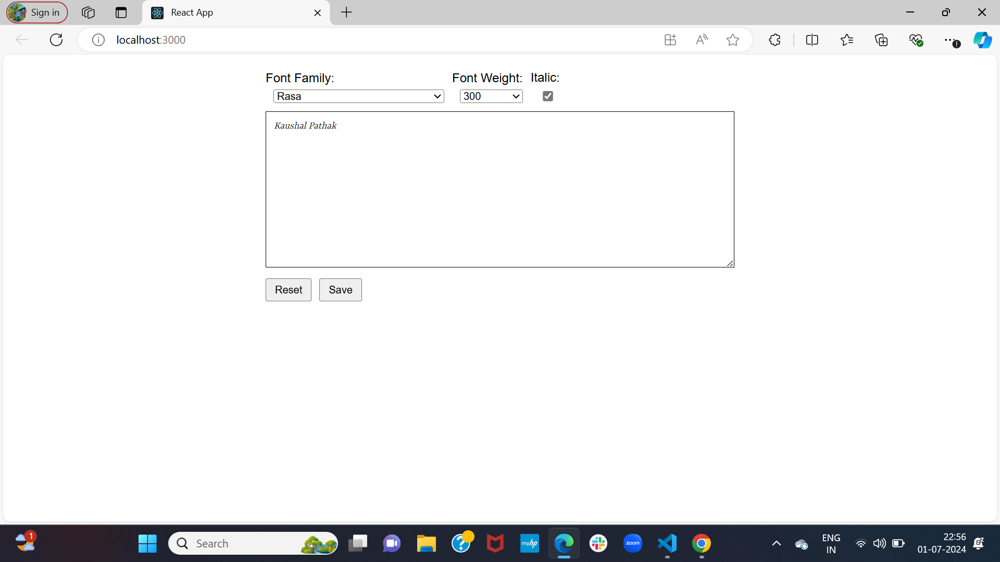

# Text Editor App

This is a simple text editor built with React that allows users to select font family, font weight, and toggle italic styling for the text. The app uses Google Fonts API to fetch available fonts and supports auto-save functionality using local storage.

## Features

- **Font Family Selection:** Choose from a list of Google Fonts.
- **Font Weight Selection:** Choose from the weights available for the selected font.
- **Italic Toggle:** Toggle italic styling if the selected font and weight combination supports it.
- **Auto Save:** Automatically saves the text and font settings to local storage.
- **Reset:** Reset the editor to its default state.

## [Screenshots](#screenshots)


## Getting Started

### Prerequisites

- Node.js (v12 or later)
- npm (v6 or later) or yarn (v1.22 or later)

### Installation

1. Clone the repository:
   ```sh
   git clone https://github.com/yourusername/react-text-editor.git
   cd react-text-editor


